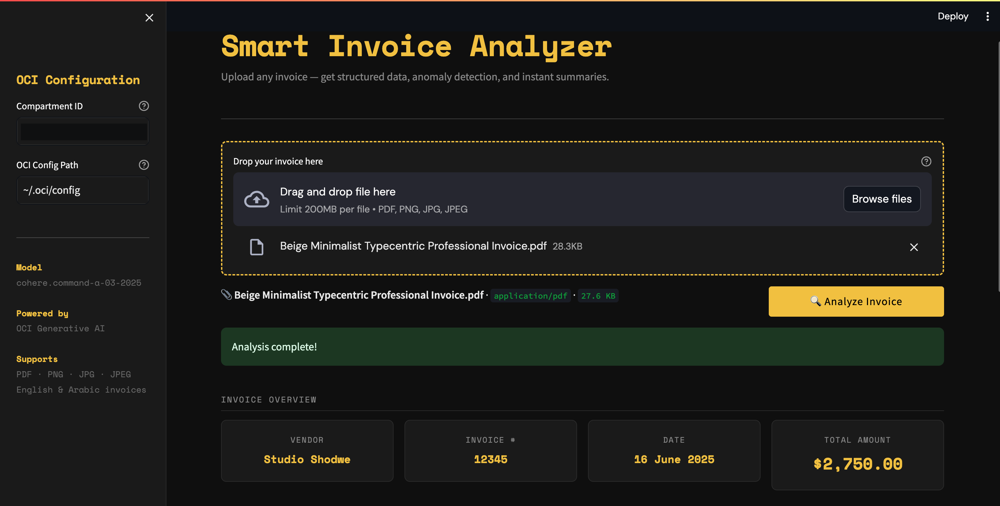
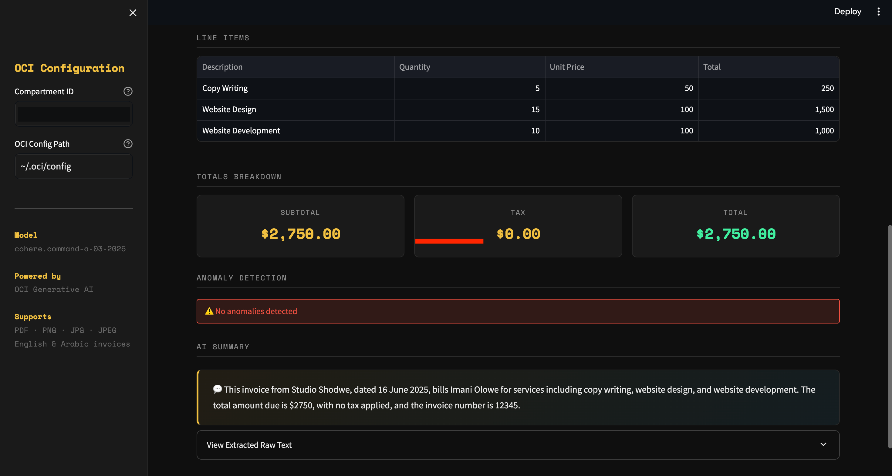

# Smart Invoice Analyzer

An AI-powered invoice analysis tool built on **OCI Generative AI** using **Cohere Command-A**. Upload any invoice and instantly get structured data, anomaly detection, and a plain-English summary.

---
## 📸 Screenshots




---

## Features

- **Multi-format Support** — Upload invoices as PDF or images (PNG, JPG)
- **Smart Extraction** — Automatically pulls vendor, date, invoice number, and all line items
- **Totals Breakdown** — Subtotal, tax, and total amount displayed clearly
- **Anomaly Detection** — Flags duplicate items, math errors, and missing fields
- **AI Summary** — Plain-English 2-sentence summary of every invoice
- **Arabic & English** — Supports bilingual invoices

---

## Getting Started

### 1. Install dependencies
```bash
pip install -r requirements.txt
```

### 2. Install Tesseract OCR
```bash
# macOS
brew install tesseract

### 3. Configure OCI
Make sure your `~/.oci/config` is set up with valid credentials and access to OCI Generative AI.

### 4. Run the app
```bash
streamlit run app.py
```